# Swiss Print LT Deck

HTML/CSS/JavaScript だけで作られたライトニングトーク用スライドテンプレートです。
ビルド環境なしで、ブラウザでそのまま発表・編集・PDF出力ができます。

## 作成した背景

LT会で発表する機会が増えました。スライドを毎回1から作ると、話す内容よりも先にデザインに手を出してしまい、
配色やレイアウトをいじっているうちに時間が溶けます。

一方で、自分が聞く立場になると、見ているのはデザインではなく発表の内容です。
デザインはある程度、外していなければそれでいい。凝ったところで伝わりやすさはそれほど変わりません。

なので、デザインのほうを先に固定してしまうことにしました。
配色・タイプスケール・罫線の濃度・使ってよい装飾をテンプレート側で決め打ちにして、
発表のたびに判断し直す余地をなくしています。スイス様式を選んだのは、
装飾を足さずに「外さない」状態を作りやすいからです。

あわせて Claude Code の skill（[`.claude/skills/lightning-talk/`](.claude/skills/lightning-talk/)）を同梱し、
ヒアリング → 流し込み → 検証までを任せられるようにしました。
テンプレートと生成手順をひとつのリポジトリに入れてあるのは、この2つが揃ってはじめて
「中身だけ考えれば資料ができる」状態になるからです。

## Swiss Print とは

このテンプレートのデザインテーマの名前です。一般的な用語ではなく、このリポジトリで付けた呼び名です。

1950年代のスイスで広まったインターナショナル・タイポグラフィ様式（スイス・スタイル）を、
印刷物のような見た目でスライドに当てはめています。グリッドで位置を決め、
余白と罫線とアクセント1色で情報の階層を作ります。

- 地は純白ではなく、少し暖かい紙色の `#F2F0EB`
- 見出し・本文・図版を12カラムのグリッドに合わせる
- アクセントは朱赤 `#D6402B` の1色だけ、1枚に1〜2箇所まで
- 角丸・グラデーション・影・絵文字は使わず、面の区切りは罫線と余白で行う

守ってほしい規律は[デザインの規律](#デザインの規律)にまとめてあります。

スライドの表示や操作は `deck-stage.js` / `image-slot.js` が担当していて、
Swiss Print はその上のスタイル部分を指します。

## 開き方

```
.claude/skills/lightning-talk/assets/template.html    # 全22種を含む参照デッキ
examples/serverless-solo-dev/serverless-solo-dev.html # 流し込み済みの実例（全17枚）
examples/build-free-slides/build-free-slides.html     # 流し込み済みの実例（全10枚）
```

HTMLファイルをブラウザ（Chrome / Edge 推奨）で開くだけです。
`deck-stage.js` と `image-slot.js` は **HTMLと同じ階層に置いたまま**使ってください。

## 操作

| キー | 動作 |
| --- | --- |
| `→` / `Space` | 次のスライド |
| `←` | 前のスライド |
| `R` | 先頭に戻る |
| `T` | サムネイル一覧の表示/非表示 |
| `Cmd/Ctrl + P` | 印刷ダイアログ → PDFとして保存 |

`<image-slot>` の枠には、画像ファイルをドラッグ＆ドロップするとその場で差し込めます。

## 収録しているスライド種別（全22種）

|   |   |   |
| --- | --- | --- |
| 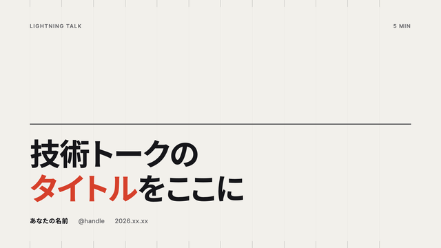<br>`s-title` 表紙 | 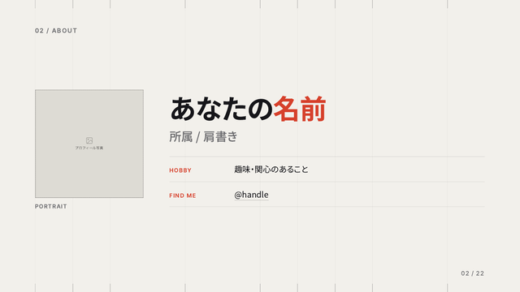<br>`s-about` 自己紹介 | 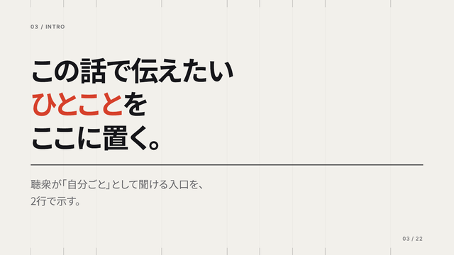<br>`s-intro` はじめに |
| 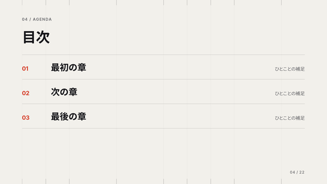<br>`s-agenda` 目次 | 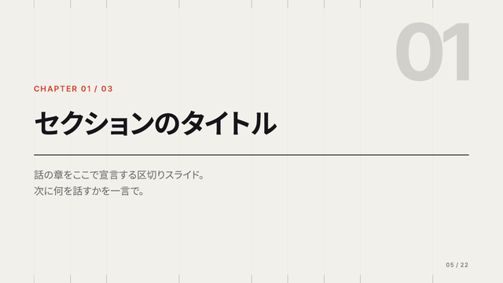<br>`s-section` 章扉 | 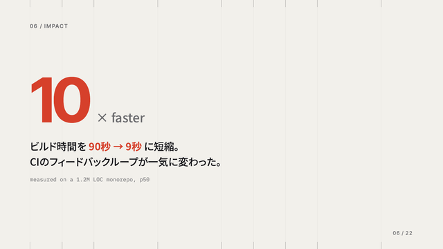<br>`s-stat` 大きな数字 |
| 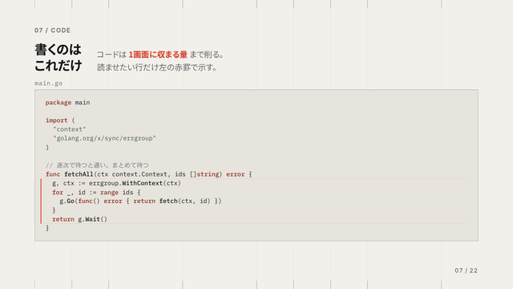<br>`s-code` コード | 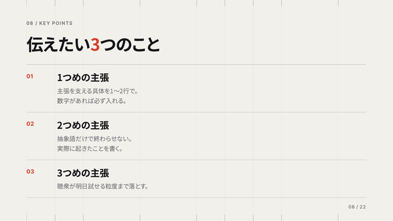<br>`s-bullets` 3要点 | 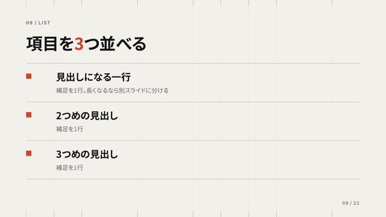<br>`s-list` 箇条書き |
| 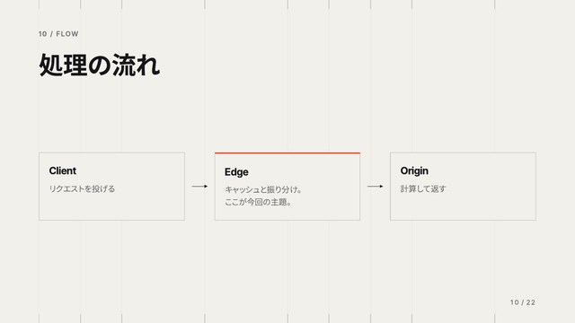<br>`s-diagram` フロー図 | 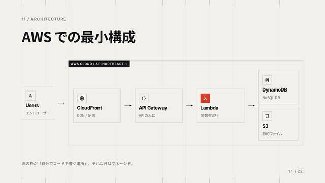<br>`s-aws` AWS構成図 | 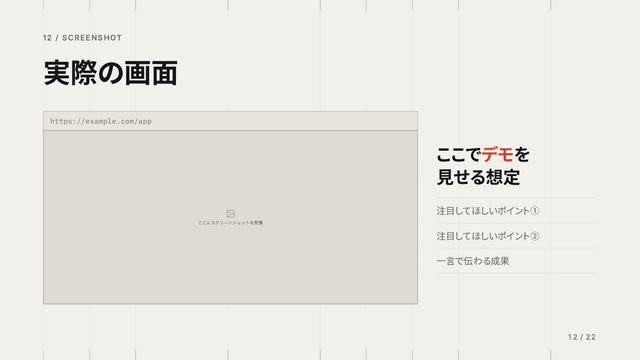<br>`s-shot` スクリーンショット |
| 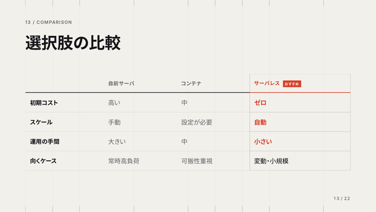<br>`s-table` 比較表 | 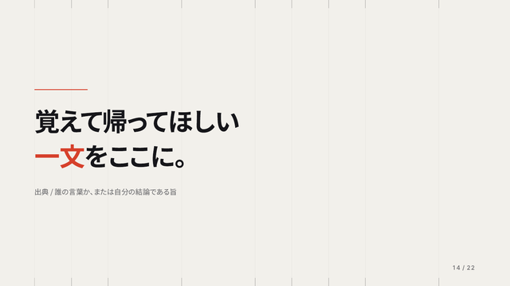<br>`s-quote` 引用 | 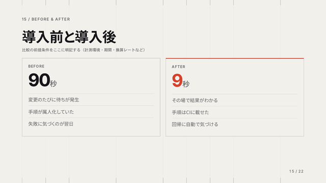<br>`s-ba` Before/After |
| 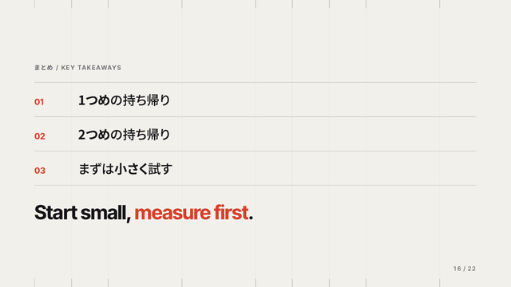<br>`s-cta` まとめ | 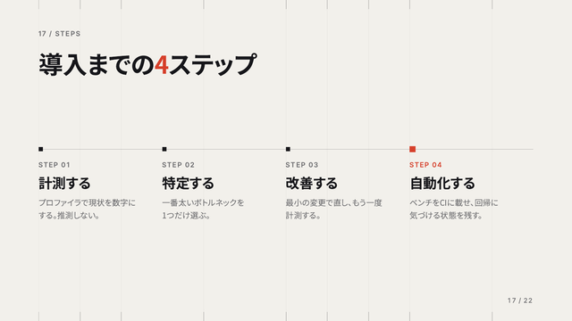<br>`s-steps` 手順 | 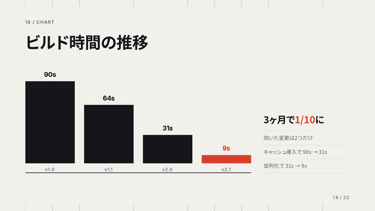<br>`s-chart` 棒グラフ |
| 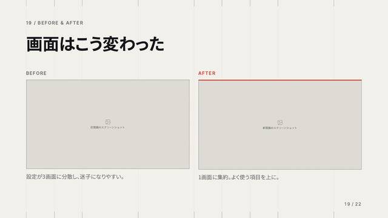<br>`s-shot2` 画面比較 | 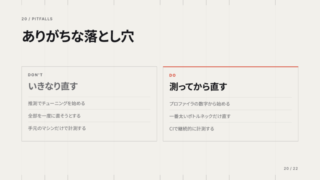<br>`s-dont` Do/Don't | 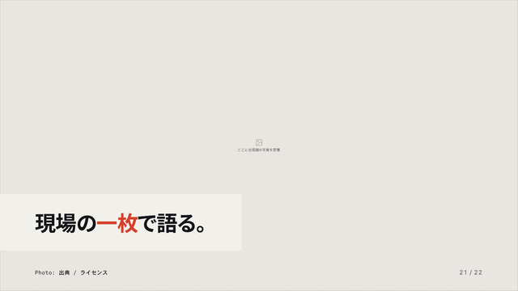<br>`s-photo` 全画面写真 |
| 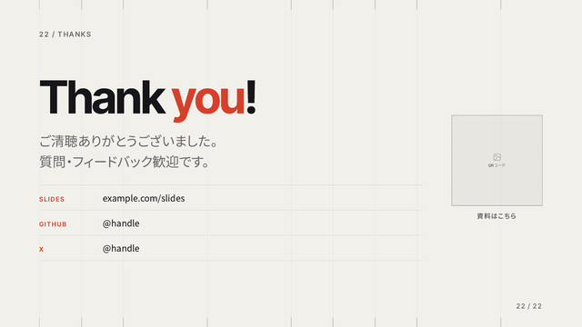<br>`s-thanks` 締め・QR |  |  |

各種別の編集ポイントは
[`references/slide-types.md`](.claude/skills/lightning-talk/references/slide-types.md) にあります。

## デザインの規律

流し込むときに崩さないでほしい5点です。1〜3は見た目の一貫性の話ですが、**4と5を外すと実際に読めなくなります**。

1. **角丸 0 / グラデーション 0 / 影 0 / 絵文字 0。** 面を分けるのは罫線と余白だけ。
2. **アクセント（朱赤 `#D6402B`）は1枚に1〜2箇所まで。** それ以外は本文色とミュート色で組む。
3. **ラベルに `//` を使わない。** kicker は `06 / KEY POINTS` の形。
4. **タイプスケールの8段（`--type-*`）から外れない。**
   スライドは `overflow: hidden` なので、大きいサイズを直に書くと収まらない行が**黙って切れます**。
   枠内で切れるため、はみ出し検査にも出てきません。
5. **罫線は4段の濃度階層を守る。** `--grid`(.05) < `--line`(.14) < `--tick` / `--line-2`(.34)。
   縦罫と横罫を同じ濃さにすると、交点が網目になって読めなくなります。

### デザイントークン

配色とフォントは `template.html` 冒頭の CSS 変数に集約してあります。ここだけ差し替えれば全体が変わります。

```css
--bg:      #F2F0EB;   /* 純白より少し暖かい紙色。#FFF は逆に安く見える */
--surface: #E7E4DD;
--text:    #16161A;
--muted:   #6B6B6E;
--accent:  #D6402B;   /* 朱赤 */

--font-display: 'Inter Tight', 'Noto Sans JP', sans-serif;
--font-jp:      'Noto Sans JP', 'Hiragino Kaku Gothic ProN', sans-serif;
--font-mono:    'IBM Plex Mono', monospace;
```

## Claude Code でのデッキ生成（skill）

このリポジトリを Claude Code で開き、「LT資料を作りたい」のように依頼すると
[`.claude/skills/lightning-talk/`](.claude/skills/lightning-talk/) の skill が起動し、
ヒアリング → 流し込み → 検証まで行います。

ワークフローの詳細は [`SKILL.md`](.claude/skills/lightning-talk/SKILL.md)、
検証手順は [`references/validation.md`](.claude/skills/lightning-talk/references/validation.md) を参照してください。

## 構成

```
.claude/skills/lightning-talk/
  SKILL.md                  Claude Code 用のワークフロー
  assets/
    template.html           全22種を含む参照デッキ（これをコピーして使う）
    deck-stage.js           スライド表示・キー操作・サムネイル・印刷レイアウト
    image-slot.js           画像のドラッグ＆ドロップ差し替え枠
  references/
    slide-types.md          全22種の編集ポイント
    cover-image.md          表紙に写真を敷く手順
    aws-diagram.md          AWS構成図と公式アイコン
    validation.md           はみ出し検査・完成チェック・PDF出力
examples/
  serverless-solo-dev/      流し込み済みの実例（全17枚）
  build-free-slides/        流し込み済みの実例（全10枚）
docs/
  slide-types/              上の一覧で使っているスライド種別のスクリーンショット
```

## ライセンス

[MIT](LICENSE)
